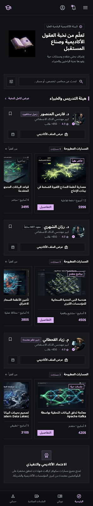
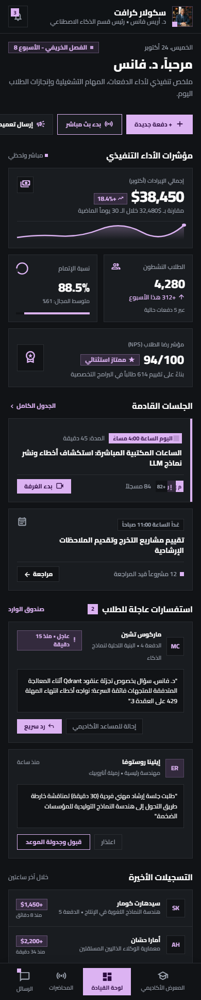
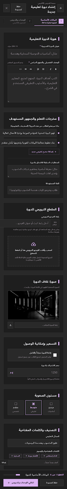
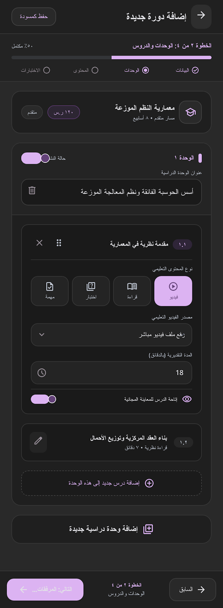
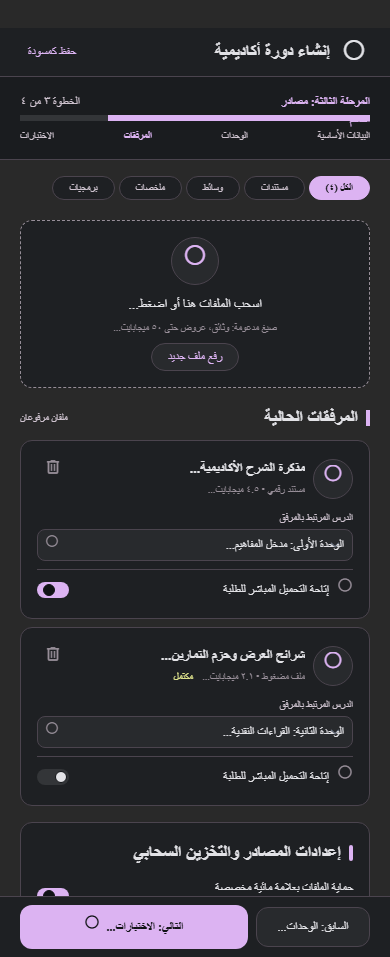
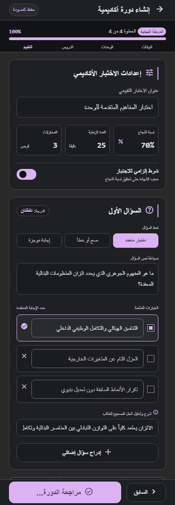

## Mishkaa

* Mishkaa is an academic teacher-focused educational platform designed to serve the Egyptian secondary school sector.
* The platform is centered around teacher marketing and academic workflows + student all-in-one feature not just course listing app 

## Project Overview

Mishkaa aims to serve both: 
* Teacher.. via providing him centralized platform for marketing themselves and managing their academic activities instead of relying on disconnected tools and manual workflows.
* Student.. via providing him centralized platform that prevent his distraction between more than teacher website or youtube channels.

### Teacher features 
* Treat the teacher portfolio as the thing to market instead of the plain courses
* Secured courses hosting which is critical for them
* Do the heavy load of the technical work instead of overwhelming the teacher of it
* Dashboard provides the usual structured environment for managing educational content, students, assessments, academic activities, and the operational processes surrounding secondary education

### Student features 
* provide the one sound of truth to the student where centralize all of his subjects teachers at one place
* Friendly UI/UX + secured payment cycle
* Tracking academic activities
* Supporting structured academic workflows

The architecture is designed so additional educational features can be introduced without requiring major changes to the existing system.

## Technology Stack

### Frontend

* TypeScript | ReactNative | Expo
* Modern component-based UI architecture (react native reusables)
* tansStack (reactQuery) + Axios (network layer)

### Backend + DB
* Node.js | TypeScript | NestJS | typeOrm | Cloudflare | PostgreSQL

### Why TypeScript?

TypeScript provides static typing across the frontend and backend, reducing inconsistencies between API contracts and client-side models while making the codebase easier to maintain as the project grows.

### Why NestJS?

NestJS provides a structured architecture for Node.js applications and encourages modularity, dependency injection, separation of concerns, and testable business logic.

### Why Next.js (later)?

Next.js provides a flexible React-based framework for building the web application while supporting different rendering and data-fetching strategies as the platform evolves.

### Why PostgreSQL?

The educational domain contains many strongly related entities and transactional workflows. PostgreSQL provides relational integrity, transactions, indexing, and mature querying capabilities suitable for this type of application.

## Architecture
## Backend Structure
## Teacher Dashboard
## Content Management
## Data Modeling
## Security Considerations
## Engineering Decisions
## Challenges

## Preview
* Note: the Project still in the dev mode so these is the AI generated UI that I follow it as a reference, <strong>the actual screens will be added later</strong>

More project visuals and promotional material are available in the [`docs`](./docs) directory.
